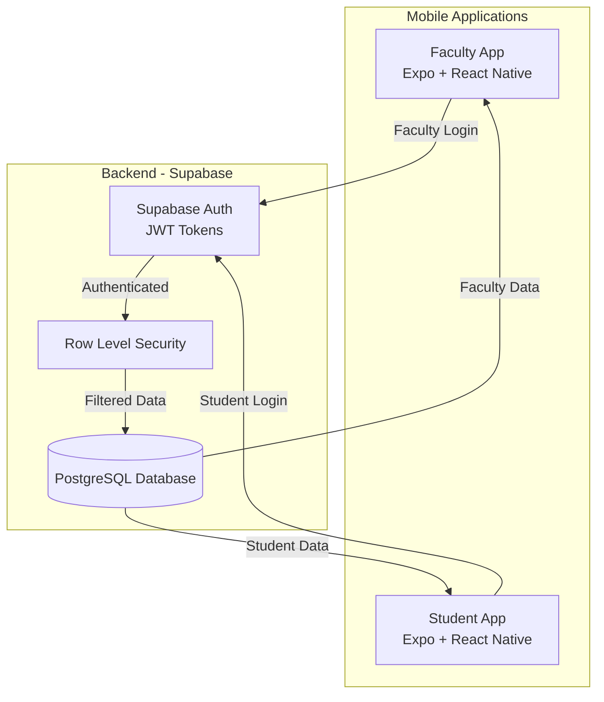
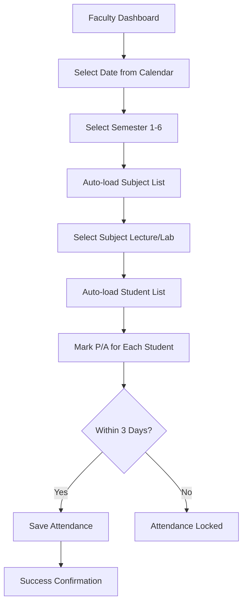
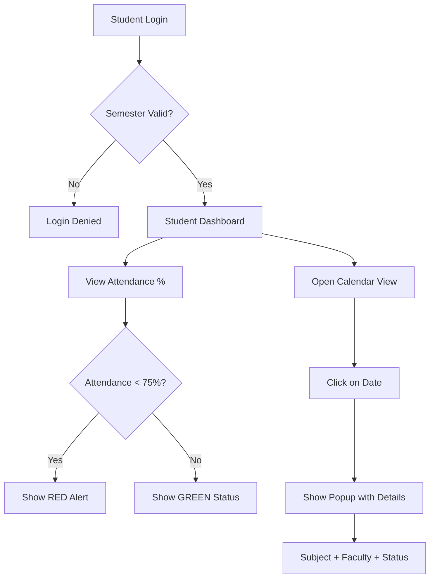

# 🎓 Student Attendance Management System

> **A Production-Ready, Full-Stack Mobile Application for Academic Institutes**  
> Built with Expo + React Native & Supabase PostgreSQL

---

## 📋 Project Overview

This is a **real-world, industry-standard** Student Attendance Management System developed as an academic project for Government Polytechnic College evaluation. The system consists of **two separate mobile applications** sharing a unified Supabase backend with enterprise-level security.

### 🎯 Key Highlights

- ✅ **Dual Mobile Apps**: Separate Faculty and Student applications
- ✅ **Real-time Database**: PostgreSQL with Supabase backend
- ✅ **Enterprise Security**: Row Level Security (RLS) policies
- ✅ **Role-based Access**: Strict faculty/student segregation
- ✅ **Calendar Integration**: Date-based attendance tracking
- ✅ **Auto-locking Mechanism**: 3-day attendance edit window
- ✅ **Production-ready Code**: Clean, documented, industry-standard

---

## 🏗️ System Architecture

### Applications

#### 1️⃣ **Faculty Application**
*For Teachers and Instructors*

- **Authentication**: Faculty ID/Email + Password
- **Dashboard**: Personal calendar, student management
- **Attendance Module**: Date-wise marking with subject selection
- **Student Management**: Activate/deactivate, bulk operations
- **Access Control**: Only assigned subjects and students

#### 2️⃣ **Student Application**
*For Students (Read-only Access)*

- **Authentication**: Enrollment Number + Password + Semester
- **Dashboard**: Attendance percentage, alerts
- **Calendar View**: Visual attendance history (Green/Red indicators)
- **Detailed View**: Date-wise subject, faculty, and status
- **Alert System**: Red warning when attendance < 75%

### Technology Stack

```
Frontend (Mobile Apps)
├── Expo (React Native Framework)
├── React Native (Cross-platform UI)
└── JavaScript (ES6+)

Backend
├── Supabase (Backend as a Service)
├── PostgreSQL (Relational Database)
├── Supabase Auth (Authentication)
└── Row Level Security (Data Protection)

Development Tools
├── Node.js & npm
├── Expo CLI
└── Git Version Control
```

---

## 🔐 Authentication & Security

### Faculty Login Flow
```
Faculty Enter Credentials (ID/Email + Password)
    ↓
Semester Selection
    ↓
Supabase Authentication
    ↓
Role Verification (Is Faculty?)
    ↓
Load ONLY Assigned Data (RLS Applied)
    ↓
Faculty Dashboard
```

### Student Login Flow
```
Student Enter Credentials (Enrollment + Password)
    ↓
Semester Selection (MANDATORY)
    ↓
Supabase Authentication
    ↓
Semester Validation (Match Database?)
    ↓
Role Verification (Is Student?)
    ↓
Load ONLY Own Attendance (RLS Applied)
    ↓
Student Dashboard (READ-ONLY)
```

### Security Features

- 🔒 **Row Level Security**: Database-level access control
- 🔒 **Role-based Authorization**: Faculty vs Student permissions
- 🔒 **Data Isolation**: Users can only access their own data
- 🔒 **Auto-locking**: Attendance locked after 3 days
- 🔒 **Encrypted Authentication**: Supabase secure auth
- 🔒 **No Client-side Bypass**: All rules enforced at DB level

---

## 📱 Features Breakdown

### Faculty App Features

#### 📅 Calendar-Based Attendance
- Visual calendar interface
- Select date → Auto-load attendance screen
- Semester selection (1-6)
- Subject dropdown (Lecture/Lab differentiated)
- Student list with P/A toggle
- Submit and save to database

#### 👥 Student Management
- View all students semester-wise
- Activate/Deactivate student accounts
- Bulk operations (CSV/Excel upload)
- Assign students to subjects

#### 🔒 Attendance Rules
- Edit window: **3 days from marking date**
- After 3 days: **Automatically locked**
- Lock enforced at **database level**
- No backdoor edits possible

### Student App Features

#### 📊 Dashboard
- Student name & enrollment number
- Current semester display
- **Overall attendance percentage**
- Color-coded alert system:
  - 🟢 Green: ≥ 75% attendance
  - 🔴 Red: < 75% attendance (Warning)

#### 📅 Attendance Calendar
- Monthly calendar view
- Date indicators:
  - 🟢 **Green**: Present on that day
  - 🔴 **Red**: Absent on that day
- Click on date → Show popup with:
  - Subject name
  - Lecture or Lab session
  - Faculty name
  - Attendance status (P/A)

#### 🚫 Read-only Access
- Students **CANNOT**:
  - Modify attendance
  - Delete records
  - Access other students' data
  - Edit any information

---

## 🗄️ Database Schema

### Core Tables

#### `teachers`
```sql
- teacher_id (Primary Key)
- name
- email
- faculty_id
- department
- created_at
```

#### `students`
```sql
- student_id (Primary Key)
- enrollment_number (Unique)
- name
- email
- semester (1-6)
- department
- is_active (Boolean)
- created_at
```

#### `subjects`
```sql
- subject_id (Primary Key)
- subject_name
- subject_code
- semester
- subject_type (Lecture/Lab)
- assigned_faculty_id (Foreign Key → teachers)
```

#### `attendance`
```sql
- attendance_id (Primary Key)
- student_id (Foreign Key → students)
- subject_id (Foreign Key → subjects)
- faculty_id (Foreign Key → teachers)
- date
- status (Present/Absent)
- marked_at
- is_locked (Boolean)
```

#### `semesters`
```sql
- semester_id (Primary Key)
- semester_number (1-6)
- academic_year
- start_date
- end_date
```

#### `academic_years`
```sql
- year_id (Primary Key)
- year_name (e.g., "2025-26")
- start_date
- end_date
- is_current (Boolean)
```

---

## 🛡️ Row Level Security Policies

### Faculty Policies
```sql
-- Faculty can only view their assigned subjects
CREATE POLICY faculty_view_own_subjects ON subjects
FOR SELECT USING (assigned_faculty_id = auth.uid());

-- Faculty can only mark attendance for their students
CREATE POLICY faculty_mark_attendance ON attendance
FOR INSERT WITH CHECK (
  faculty_id = auth.uid() 
  AND EXISTS (
    SELECT 1 FROM subjects 
    WHERE subject_id = attendance.subject_id 
    AND assigned_faculty_id = auth.uid()
  )
);

-- Faculty can edit attendance only within 3 days
CREATE POLICY faculty_edit_within_3days ON attendance
FOR UPDATE USING (
  faculty_id = auth.uid() 
  AND is_locked = false
  AND marked_at >= NOW() - INTERVAL '3 days'
);
```

### Student Policies
```sql
-- Students can only view their own attendance
CREATE POLICY student_view_own_attendance ON attendance
FOR SELECT USING (student_id = auth.uid());

-- Students cannot insert, update, or delete
CREATE POLICY student_no_insert ON attendance
FOR INSERT WITH CHECK (false);

CREATE POLICY student_no_update ON attendance
FOR UPDATE USING (false);

CREATE POLICY student_no_delete ON attendance
FOR DELETE USING (false);
```

---

## 📐 System Flowcharts

### Overall System Architecture


### Faculty Attendance Flow


### Student Attendance View Flow


---

## 🚀 Getting Started

### Prerequisites
```bash
- Node.js (v14 or higher)
- npm or yarn
- Expo CLI
- Supabase Account
- Git
```

### Installation Steps

1️⃣ **Clone the Repository**
```bash
git clone <repository-url>
cd student-attendance-system
```

2️⃣ **Install Dependencies**
```bash
# For Faculty App
cd faculty-app
npm install

# For Student App
cd ../student-app
npm install
```

3️⃣ **Setup Supabase**
- Create a new Supabase project
- Copy `SUPABASE_URL` and `SUPABASE_ANON_KEY`
- Create `.env` file in both apps:

```env
SUPABASE_URL=your_supabase_url
SUPABASE_ANON_KEY=your_anon_key
```

4️⃣ **Run Database Migrations**
```bash
# Execute SQL files in Supabase SQL Editor
# 1. schema.sql
# 2. rls-policies.sql
# 3. seed-data.sql (optional)
```

5️⃣ **Start Development Servers**
```bash
# Faculty App
cd faculty-app
npx expo start

# Student App
cd student-app
npx expo start
```

---

## 📂 Project Structure

```
student-attendance-system/
├── faculty-app/
│   ├── src/
│   │   ├── screens/
│   │   │   ├── LoginScreen.js
│   │   │   ├── DashboardScreen.js
│   │   │   ├── AttendanceScreen.js
│   │   │   └── StudentManagementScreen.js
│   │   ├── components/
│   │   │   ├── Calendar.js
│   │   │   ├── StudentList.js
│   │   │   └── SubjectPicker.js
│   │   ├── services/
│   │   │   ├── supabaseClient.js
│   │   │   └── authService.js
│   │   └── utils/
│   ├── App.js
│   └── package.json
│
├── student-app/
│   ├── src/
│   │   ├── screens/
│   │   │   ├── LoginScreen.js
│   │   │   ├── DashboardScreen.js
│   │   │   └── AttendanceCalendarScreen.js
│   │   ├── components/
│   │   │   ├── AttendanceCalendar.js
│   │   │   ├── AttendanceCard.js
│   │   │   └── AlertBadge.js
│   │   ├── services/
│   │   │   ├── supabaseClient.js
│   │   │   └── authService.js
│   │   └── utils/
│   ├── App.js
│   └── package.json
│
├── database/
│   ├── schema.sql
│   ├── rls-policies.sql
│   ├── functions.sql
│   └── seed-data.sql
│
├── docs/
│   ├── ARCHITECTURE.md
│   ├── DOCUMENTATION.md
│   ├── DATABASE_SCHEMA.md
│   └── SECURITY.md
│
└── README.md
```

---

## 🧪 Testing Strategy

### Unit Testing
- Authentication flows
- Database queries
- RLS policy validation
- Date calculations

### Integration Testing
- Faculty marking attendance
- Student viewing attendance
- Auto-lock mechanism
- Semester validation

### Manual Testing
- UI/UX testing on real devices
- Cross-platform compatibility (iOS/Android)
- Network error handling
- Edge cases (expired sessions, invalid data)

---

## 🎓 Learning Outcomes

### For Students Working on This Project

#### Technical Skills
- ✅ **Mobile Development**: React Native & Expo
- ✅ **Backend Integration**: REST APIs & Supabase
- ✅ **Database Design**: Normalization & relationships
- ✅ **Security**: Authentication & authorization
- ✅ **State Management**: React hooks & context

#### Professional Skills
- ✅ **Clean Code**: Readable, maintainable code
- ✅ **Documentation**: Technical writing
- ✅ **Version Control**: Git workflow
- ✅ **Problem Solving**: Real-world challenges
- ✅ **Project Planning**: Architecture design

---

## 👥 Team Members

| Name | Role | Responsibilities |
|------|------|-----------------|
| [Your Name] | Lead Developer | Overall architecture, backend setup |
| [Team Member 2] | Frontend Developer | Faculty app UI/UX |
| [Team Member 3] | Frontend Developer | Student app UI/UX |
| [Team Member 4] | Database Designer | Schema design, RLS policies |

---

## 📝 Documentation

- 📘 [System Architecture](./docs/ARCHITECTURE.md) - Complete system design
- 📘 [Technical Documentation](./docs/DOCUMENTATION.md) - Detailed specs
- 📘 [Database Schema](./docs/DATABASE_SCHEMA.md) - Full database design
- 📘 [Security Guide](./docs/SECURITY.md) - RLS policies & auth flows

---

## 🎯 Project Timeline

| Phase | Duration | Status |
|-------|----------|--------|
| **Planning & Documentation** | Week 1 | ✅ Complete |
| **Database Design** | Week 2 | 🔄 In Progress |
| **Faculty App Development** | Week 3-4 | ⏳ Pending |
| **Student App Development** | Week 5-6 | ⏳ Pending |
| **Testing & Bug Fixes** | Week 7 | ⏳ Pending |
| **Deployment & Presentation** | Week 8 | ⏳ Pending |

---

## 🏆 Evaluation Criteria

### For Academic Assessment

- ✅ **Functionality**: All features working as specified
- ✅ **Code Quality**: Clean, documented, industry-standard
- ✅ **Security**: Proper authentication & authorization
- ✅ **Database Design**: Normalized, efficient schema
- ✅ **UI/UX**: Professional, user-friendly interface
- ✅ **Documentation**: Comprehensive technical docs
- ✅ **Presentation**: Clear explanation of architecture

---

## 📞 Contact & Support

For questions or issues related to this project:

- 📧 Email: [your-email@example.com]
- 📱 Phone: [Your Phone Number]
- 🔗 GitHub: [Your GitHub Profile]

---

## 📄 License

This project is developed as an academic assignment for Government Polytechnic College.  
© 2026 All Rights Reserved.

---

## 🙏 Acknowledgments

- **Government Polytechnic College** - For project guidance
- **Supabase Team** - For excellent backend platform
- **Expo Team** - For React Native framework
- **Open Source Community** - For invaluable resources

---

<div align="center">

**Built with ❤️ by [Your Team Name]**

**For Academic Excellence & Real-World Impact**

</div>
